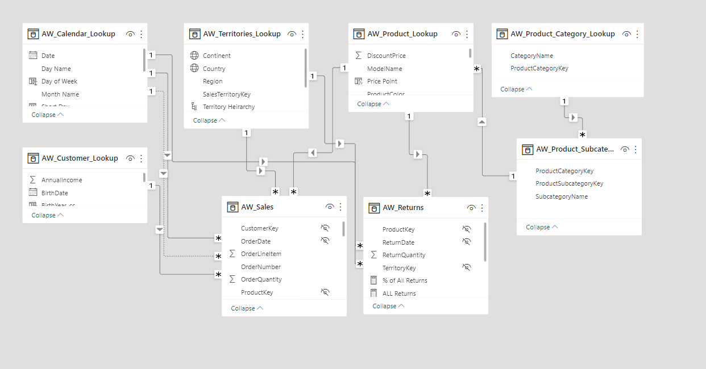
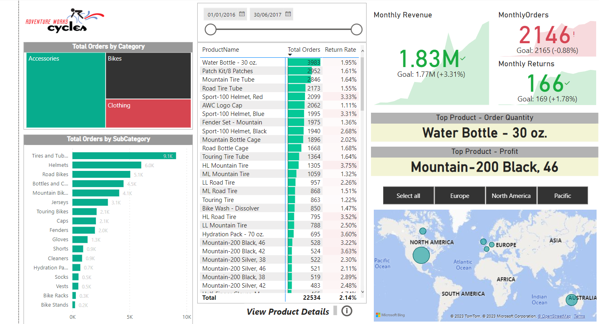
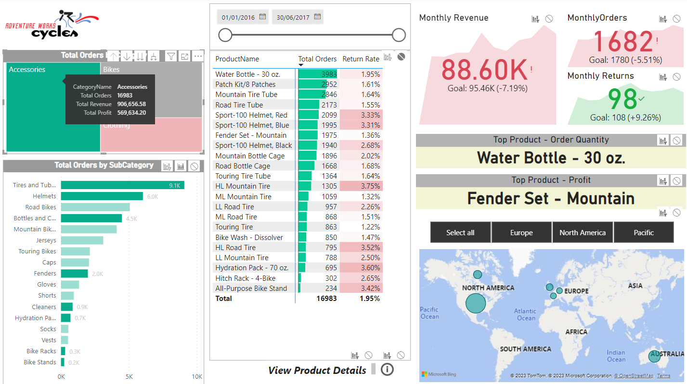

## Purpose 

The purpose of this project is to design and deliver an end-to-end business intelligence solution for Adventure Works Cycles, a global manufacturing company.

## Brief 

The client needs a way to track KPIs(sales, revenue, profit, returns), compare regional performance, analyze product-level trends and forecasts and identify high-value customers.

## Tools Used

- MS Excel
- Microsoft Power BI

## Project Objective 

- Connect and transform the raw data
- Build a relational data model
- Create new calculated columns and DAX measures
- Design an interactive report to analyze and visualize the data

## Data 

The following csv files have been used for the purpose of this project

- AdventureWorks_CalendarLookup
- AdventureWorks_CustomerLookup
- AdventureWorks_ProductCategoryLookup
- AdventureWorks_ProductSubcategoryLookup
- AdventureWorks_ProductLookup
- AdventureWorks_TerritoriesLookup
- AdventureWorks_Sales
-AdventureWorks_Returns

## Table Relationships & Data Model

## Data Visualization

An interactive dashboard has been created that can be used by the end-user to discover the key trends and patterns

### Page 1 : Executive Summary

- The Executive Summary page provides a high level analysis of the Total Orders received by the company by Product Category and Product Sub-category. It also includes the Total Revenue and Total Profit by each category and sub-category.

- The Matrix shows the Total Orders and the Return Rate by Product Name.
- It explores important KPIs such as Current Month Revenue, Current Month Orders and Current Month Returns compared to previous month's figures.
- The page also shows the Top Product in terms of order quantity and Top Product in terms of Profit.
- The page also allows the users to filter the results based on geographic locations relevant to them.
- Finally, by clicking on the product names, users can drill down further to explore more details about individual products in the Product Details Page.

